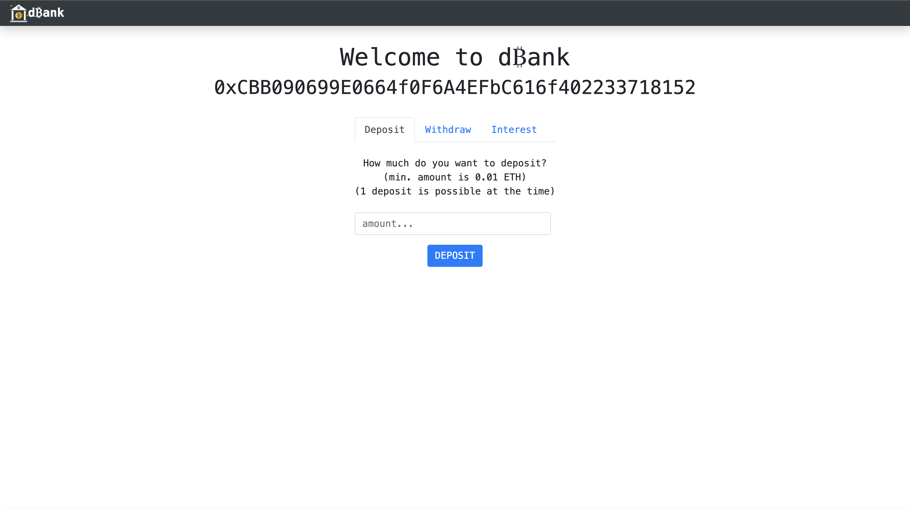
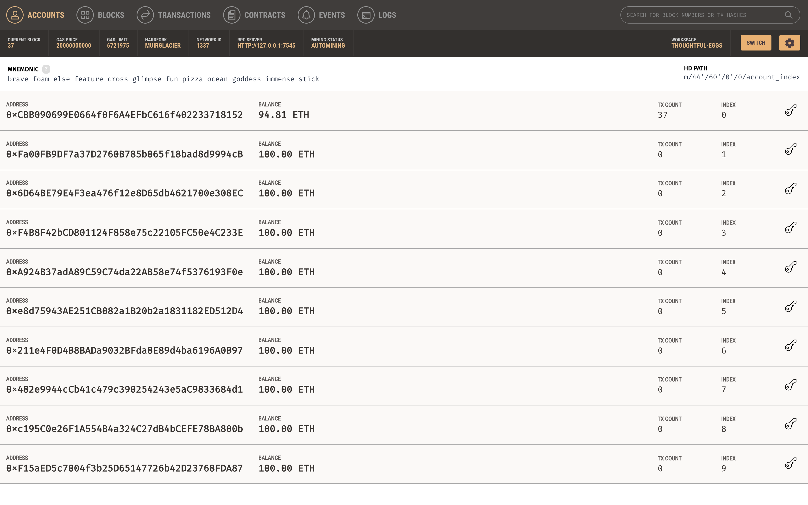
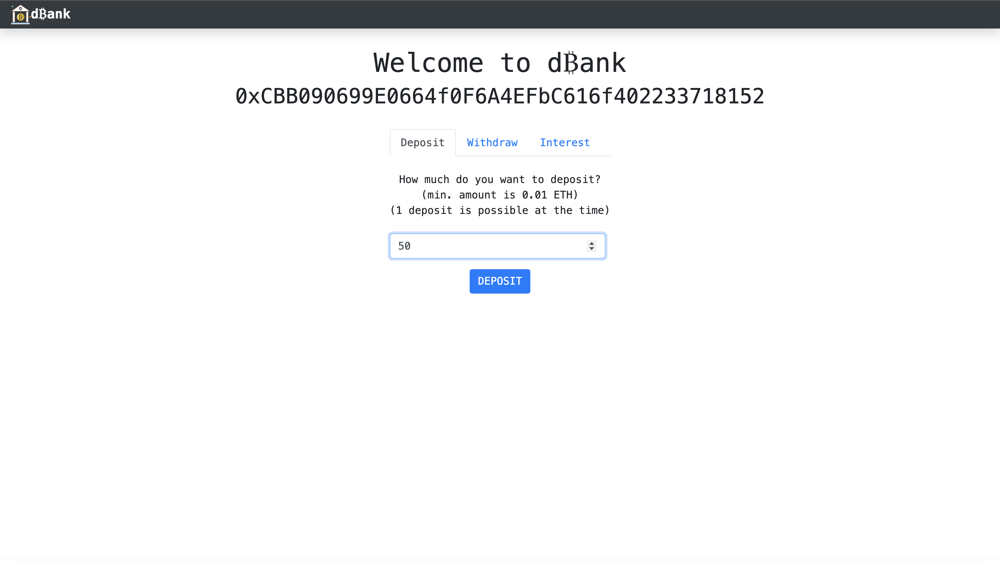
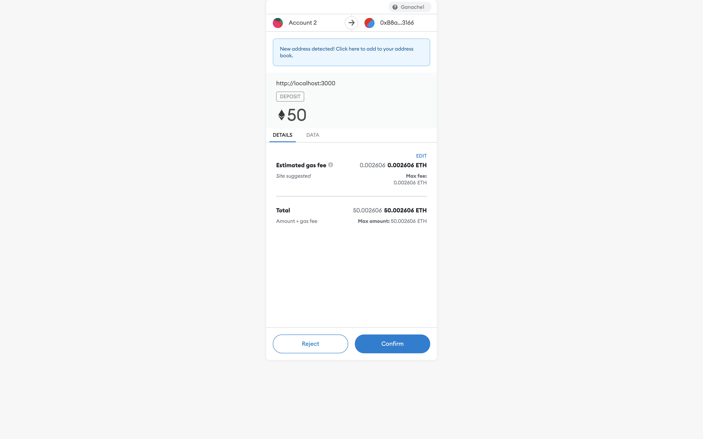
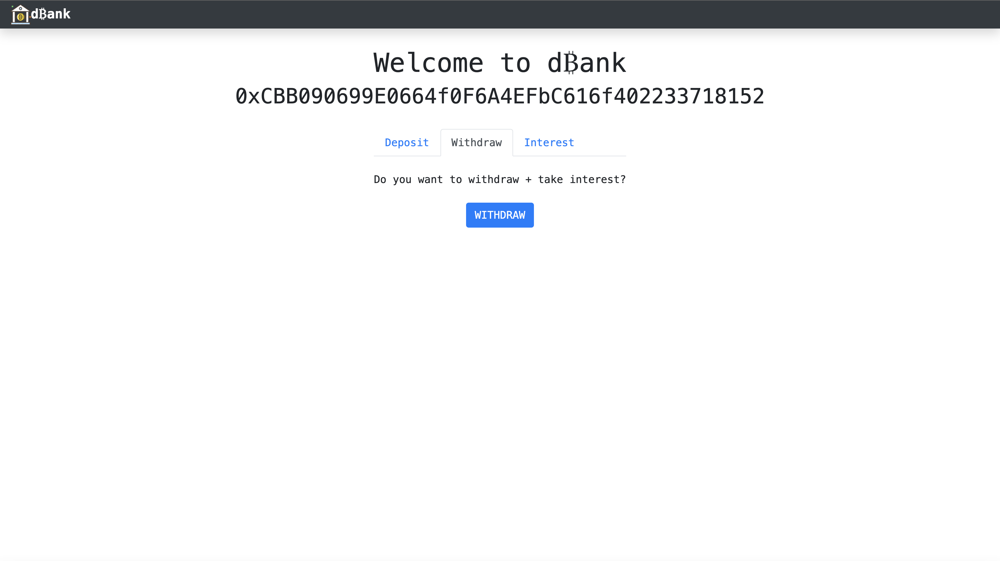
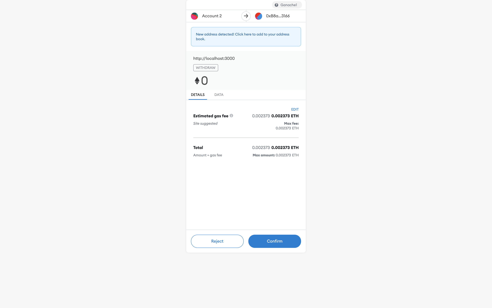
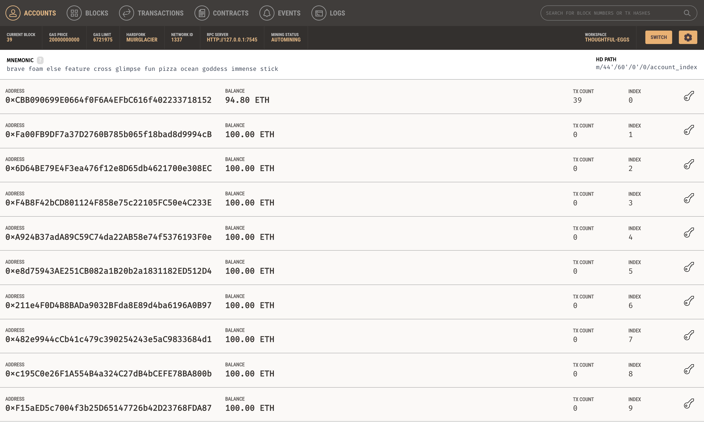
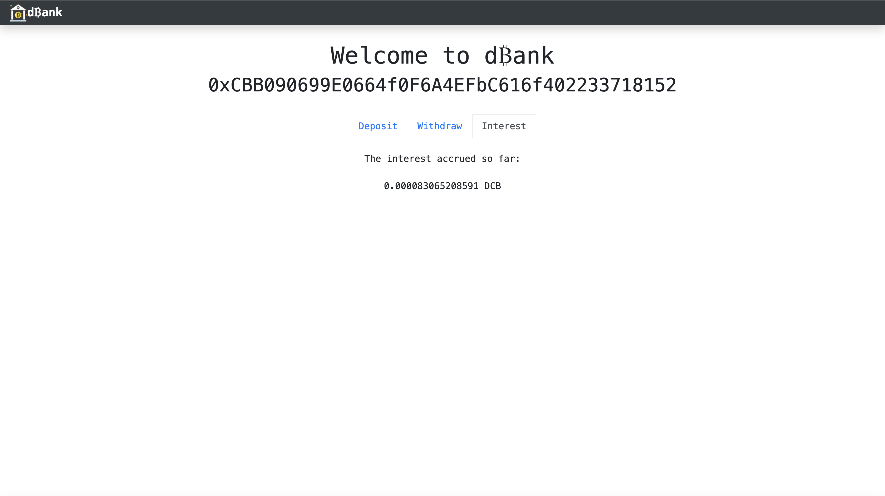
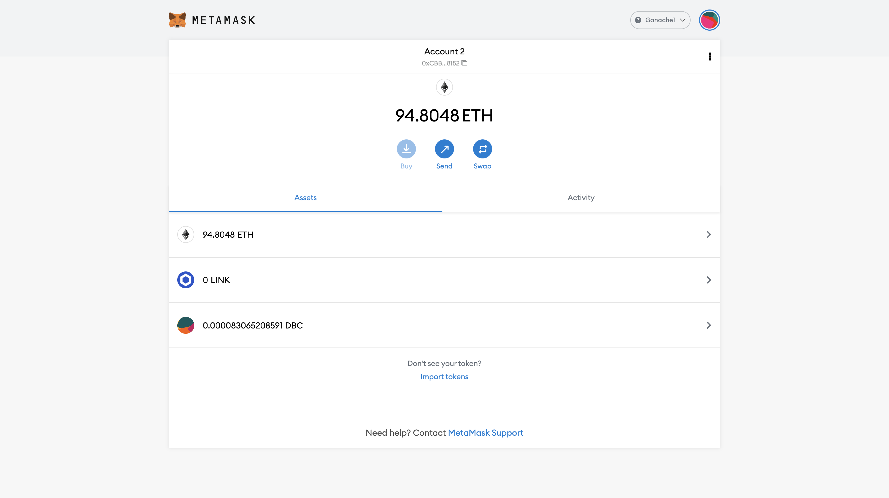

# Decentralized Bank

***



***

This project implements a decentralized bank that allows a user to deposit ETH and accumulate interest 
that gets paid off in a newly created token - DCB. 
The functionality is achieved with Solidity smart contracts:

- Token smart contract - implements a "Decentralized Bank" ERC-20 token
- Bank smart contract - keeps track of the transactions (deposit, withdrawal, accumulation of interest)

The project is tested on a developmental blockchain from Ganache and uses MetaMask to connect to the chain.

***

## Installation
To play around with the project yourself, start by forking cloning the repo locally. 
You will need to have Node.js, Truffle and Ganache installed.

Get the Node.js from [here](https://nodejs.org/en/download/).


To install truffle, use:
```bash
npm install -g truffle
```
To install Ganache, head to [their website](https://www.trufflesuite.com/ganache) and follow the instructions. 
Once you have it installed, start a new blockchain. 
It should get populated with 10 accounts, each with 100 ETH by default. 

Next, you will need to compile the smart contracts from this project to ethereum virtual machine (EVM) 
and deploy them to your local Ganache blockchain.
To do it, go to the root directory of this project and execute
```bash
truffle compile
truffle migrate
```

Next, you will need to connect the MetaMask to the local blockchain. 
First, import the Ganache account to your MetaMask:
1. Open MetaMask
2. Click on the account icon
3. Click on import account
4. Paste in the private key from any of the accounts created in Ganache 
   (you can access the private key from the 'show keys' icon on the RHS of the account field of Ganache)

Second, connect to the local network:
1. Click on the network icon in MetaMask
2. Click on 'Custom RPC'
3. Copy and paste the RPC server and network ID from the Ganache tab
4. Set the currency symbol to ETH

From the root directory, execute:
```bash
npm run start
```
This should open the application in your browser. 
You will be able to deposit and withdraw the (fake) ETH and 
see the balance change accordingly on your Ganache blockchain. 
Once you keep the ETH on deposit for some time, the interest in DBC token will get accumulated.
You can check how much of it you have by hitting the 'interest' tab.

If you want to see your DBC balance in MetaMask, you will need to import the custom token. 
To do it, go to Token.json file and copy the data from the "Address" field. 
Open you MetaMask, click on 'import tokens' and paste in your token address.

***

## How it works?

Observe the initial state of the local blockchain:



We will deposit 50 ETH from the first account to dBank.



MetaMask asks us to confirm the transaction:



You can observe that indeed 50 ETH was substracted from the account on the Ganache blockchain:


You can withdraw the deposited funds:



MetaMask asks for the confirmation again:



The funds (50 ETH) get sent back to the user's account. You can see it on Ganache blockchain:



You can observe the interest accrued from the Interest tab:



The same balance should appear on your MetaMask account as well (assuming you have imported the DBC token):



***

This project was based on [this Dapp University tutorial](https://www.youtube.com/watch?v=xWFba_9QYmc).